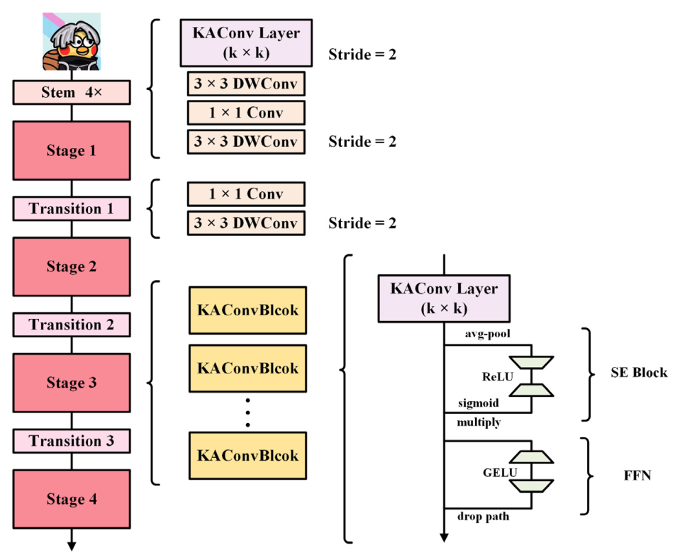
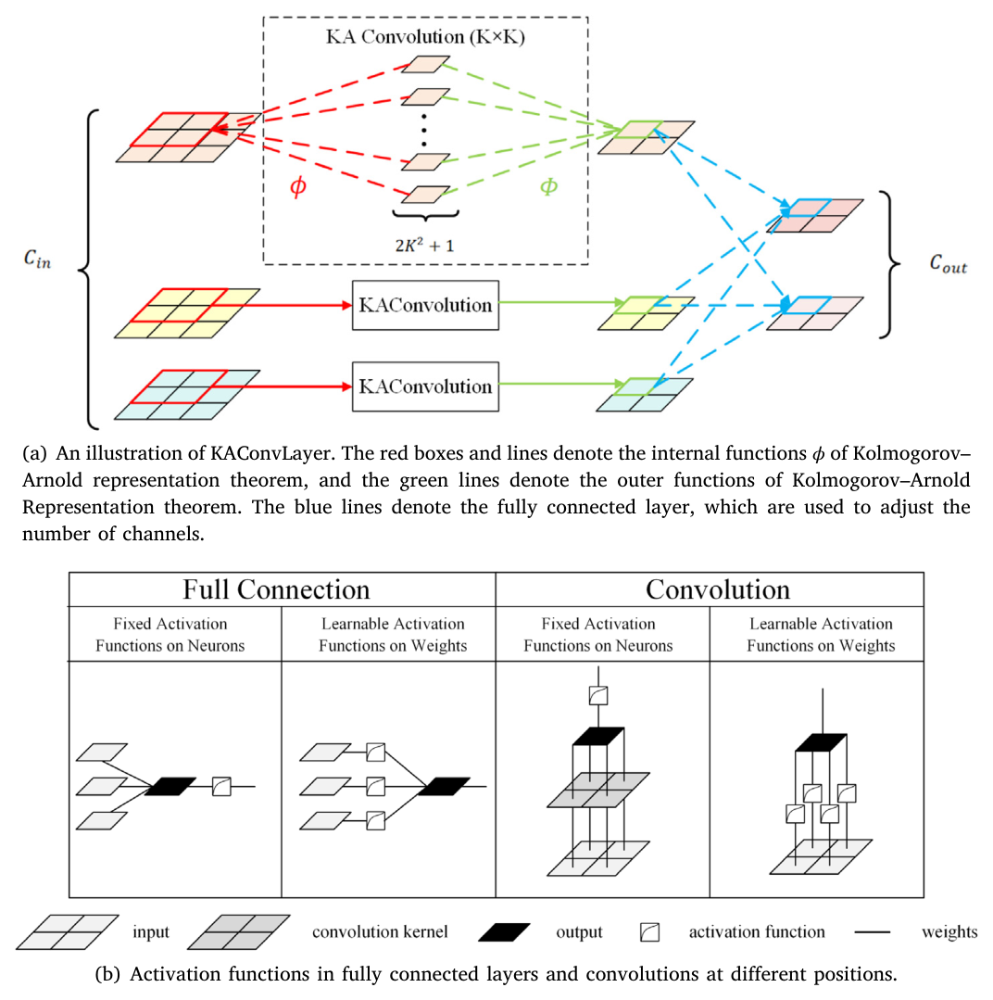
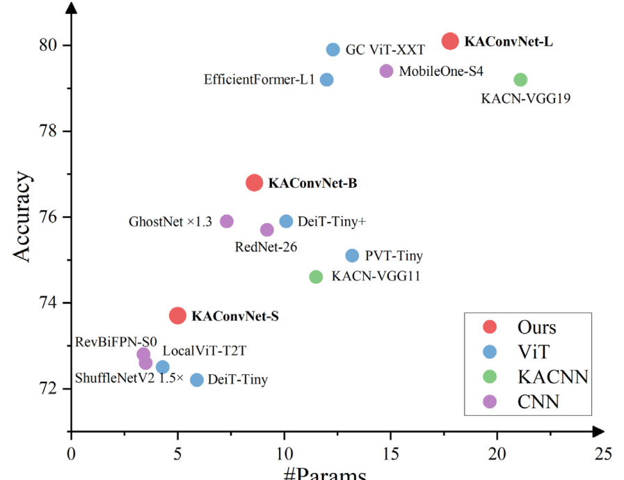

# KAConvNet

<p align="center">
  <strong>Kolmogorov–Arnold Convolutional Networks for Vision Recognition</strong>
</p>

<p align="center">
  <a href="https://doi.org/10.1016/j.imavis.2026.105983"></a>
  <a href="https://doi.org/10.1016/j.imavis.2026.105983"></a>
  
</p>

This repository contains the official PyTorch implementation of **KAConvNet**, a vision backbone built around a Kolmogorov–Arnold convolution layer.

## Overview

KAConvNet explores how the Kolmogorov–Arnold representation theorem can be integrated into convolutional networks for visual recognition. The paper proposes a **KAConvLayer** that applies learnable nonlinear mappings within channels and mixes information across channels, then builds a compact four-stage ConvNet-style backbone on top of it.

The implementation in this repository includes:

- `KAConvolution` and `KAConvolutionLayer` for Kolmogorov–Arnold convolution.
- `KAConvBlock` and `KAConvNetBlock` with residual structure and squeeze-and-excitation.
- `KAConvNet`, a four-stage image classification backbone.
- ImageNet training utilities adapted from modern ConvNet training recipes.

<p align="center">
  
</p>

## Paper Highlights

- **Kolmogorov–Arnold convolution.** KAConvLayer connects the theorem-inspired inner and outer functions to spatial aggregation and channel mixing in convolutional feature maps.
- **GLinear learnable activation.** The paper replaces heavier B-spline activations with a piecewise linear learnable function to reduce overfitting risk and improve efficiency.
- **Compact backbone design.** KAConvNet keeps a familiar stem, stages, transitions, residual blocks, and channel attention layout, making it easy to compare with CNN and ViT-style backbones.
- **General vision evaluation.** The paper reports results on ImageNet-1K classification, MS COCO object detection, and Cityscapes semantic segmentation.

<p align="center">
  
</p>

## Paper Results

### ImageNet-1K Classification

<p align="center">
  
</p>

| Model | Params | FLOPs | Top-1 Acc |
| --- | ---: | ---: | ---: |
| KAConvNet-S | 5.0M | 0.7G | 73.7 |
| KAConvNet-B | 8.6M | 1.4G | 76.8 |
| KAConvNet-L | 17.5M | 2.9G | 80.1 |

### MS COCO Object Detection

The paper evaluates KAConvNet as the backbone of RTMDet-tiny with 640 x 640 input resolution.

| Backbone | mAP | mAP50 | mAP75 |
| --- | ---: | ---: | ---: |
| KAConvNet-S | 43.3 | 60.6 | 47.1 |
| KAConvNet-B | 45.8 | 63.1 | 49.6 |
| KAConvNet-L | 48.0 | 65.7 | 51.9 |

### Cityscapes Semantic Segmentation

The paper evaluates KAConvNet as the backbone of PSPNet.

| Backbone | Mean IoU | Mean Pixel Acc |
| --- | ---: | ---: |
| KAConvNet-S | 65.32 | 76.06 |
| KAConvNet-B | 69.20 | 78.70 |
| KAConvNet-L | 70.58 | 79.51 |

## Repository Layout

| Path | Description |
| --- | --- |
| `KAConvNet.py` | Main KAConvNet, KAConvLayer, and KAConv blocks. |
| `KAConvNet_v2.py` | Alternate KAConvNet implementation. |
| `ConvNet.py` | Standard ConvNet baseline with matching architecture style. |
| `train.py` | ImageNet training and evaluation entry point. |
| `datasets.py` | Dataset construction utilities. |
| `engine.py` | Training and evaluation loops. |
| `optim_factory.py` | Optimizer and layer decay helpers. |
| `utils.py` | Distributed training, logging, checkpoint, and metric utilities. |
| `command.txt` | Example training commands. |
| `assets/` | Cropped paper figures used by this README. |

## Installation

The code uses the following main dependencies:

```bash
pip install torch torchvision timm tensorboardX pillow numpy einops
```

## Data

Prepare ImageNet-1K in the standard `torchvision.datasets.ImageFolder` layout. The example training commands expect the dataset under:

```text
datasets/ImageNet1K
```

## Quick Start

Instantiate the classifier:

```python
from KAConvNet import KAConvNet

model = KAConvNet(
    in_channels=3,
    class_nums=1000,
    channels=[32, 64, 128, 256],
    block_nums=[1, 1, 3, 1],
    drop_path=0.1,
)
```

Launch ImageNet training:

```bash
CUDA_VISIBLE_DEVICES=0,1,2,3,4,5,6,7 \
python -m torch.distributed.launch --nproc_per_node=8 --use-env train.py \
  --batch_size 256 \
  --lr 2e-3 \
  --model_ema true \
  --model_ema_eval true \
  --data_path datasets/ImageNet1K \
  --warmup_epochs 5 \
  --epochs 300 \
  --output_dir trainresults/kaconvnet-B-5-01
```

More commands are available in `command.txt`.

## Notes

- `torch.distributed.launch` is used in the example commands. Newer PyTorch setups may prefer `torchrun`.
- The paper notes that KAConvLayer improves fitting ability over standard convolution, while still carrying extra runtime overhead from learnable activations.

## Citation

If this code or paper is useful for your work, please cite:

```bibtex
@article{Liu_2026_KAConvNet,
  title = {KAConvNet: Kolmogorov–Arnold convolutional networks for vision recognition},
  author = {Liu, Zhaoxiang and Ma, Zhicheng and Zhao, Kaikai and Wang, Kai and Lian, Shiguo},
  journal = {Image and Vision Computing},
  volume = {170},
  pages = {105983},
  year = {2026},
  doi = {10.1016/j.imavis.2026.105983},
  url = {https://doi.org/10.1016/j.imavis.2026.105983}
}
```
